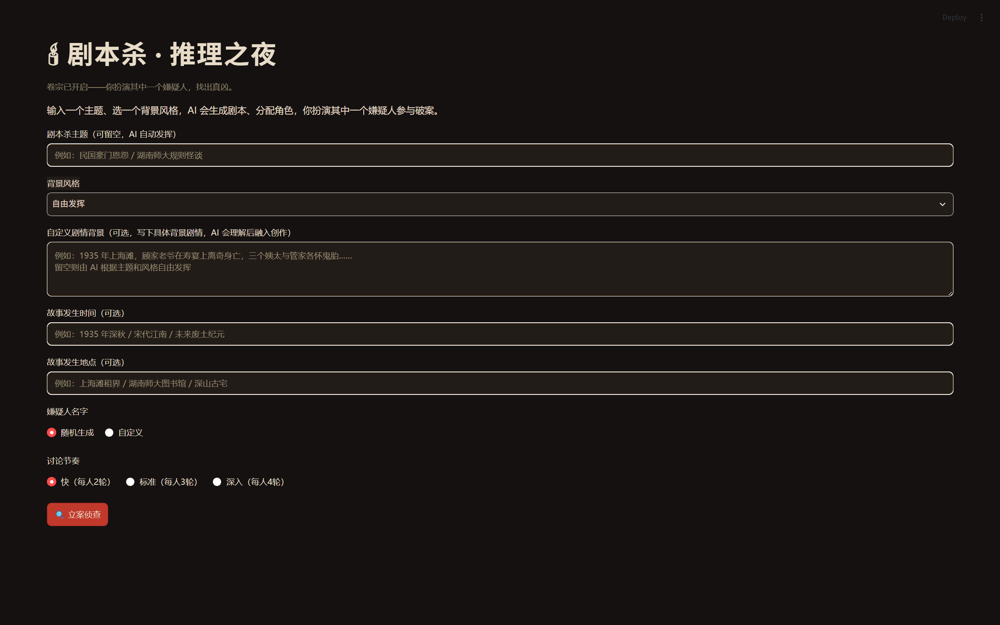
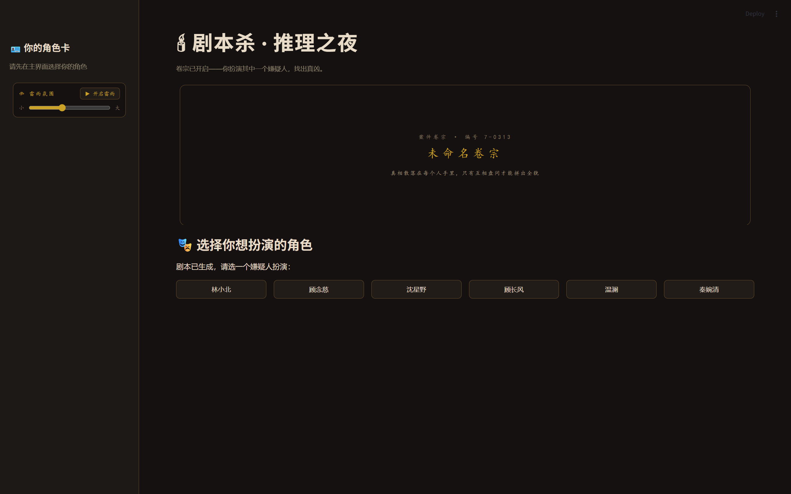
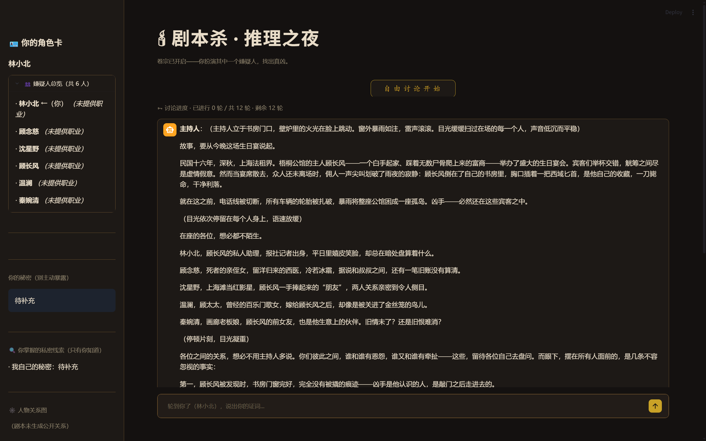

# 🎭 剧本杀·推理之夜

> 暑假智能体开发学习项目 · LangGraph 多智能体协作实战

---

## 这是什么

一个**能自己开剧本杀的 AI 主持人**——你输入主题和风格，它自动创作案件、设计嫌疑人、分配线索；然后你扮演其中一个嫌疑人，和一群 AI 同台辩论、推理、投票、抓出真凶。整个过程用 LangGraph 把十几个节点串成一张状态图，LLM 只管"说什么"，确定性逻辑只管"算不算、合不合规"。

和网上那些"AI 跑一局"的玩具不同——这是有完整信息差、角色剧本、违规校验、计票机制的硬核实现，能真的玩完一局。

---

## 📸 效果展示

| 开始页（输入主题 / 风格） | 选角色（沉浸 UI） |
|:---:|:---:|
|  |  |

| 主持人开场（左栏角色卡 + 中央故事） |
|:---:|
|  |

整套暗色档案风 UI：#141110 黑底 + 金红配色 + 雷雨氛围音 + 开场红章打字机动画 + 阶段幕布。沉浸感是"加分项"不是"主菜"——主菜还是下面的智能体架构。

---

## 🧠 智能体架构速览

整个游戏跑在 LangGraph 的 `StateGraph` 上，14 个节点依次推进：

```
START
  → generate_script（LLM 生成剧本）
  → distribute_clues（线索按 holder 分发，信息差起点）
  → choose_role ← interrupt（你选角色）
  → dm_intro（DM 开场讲故事）
  → self_intro（AI 嫌疑人自我介绍）
  → ↺ 讨论循环：ai_player_turn / human_turn / dm_midpoint
        ↑ 条件边 route_speaker 路由谁发言
  → ai_vote（AI 投票）
  → human_vote ← interrupt（你投票）
  → tally（确定性计票）
  → final_statement（得票最高者陈词）
  → dm_reveal（DM 揭晓 + 复盘）
  → END
```

**核心机制**：

- **Think / Speak 双通道**——AI 玩家先内心推理（think），再公开发言（speak），只把 speak 展示给你；凶手在心里盘算、在嘴上掩饰
- **interrupt 人在回路**——所有需要你决策的环节（选角色 / 发言 / 投票）都走 `interrupt`，图暂停等你 `Command(resume)`
- **确定性 vs LLM 分层**——LLM 只管"说什么"，校验 / 计票 / 防泄露 / 名单过滤全在 Python 节点里跑（防失控 + 省 token）
- **剧本自洽校验**——LLM 生成后跑 5+ 条硬检测（结构化字段非空、死者 ≥2 条公开边、嫌疑人间 ≥⌈N/2⌉ 条边、关系方向语义），不通过就打回重试
- **凶手狡辩策略池**——LLM 不让凶手自爆，按"被指控次数"循环使用 5 套否认 / 反问 / 嫁祸策略

---

## 🛠️ 技术栈

| 类别 | 选型 | 为什么 |
|---|---|---|
| **智能体编排** | LangGraph ≥1.0 | 图结构天然契合剧本杀的"阶段推进"，condition edge 处理"轮到谁" |
| **大模型** | DeepSeek `deepseek-v4-flash` | 中文生成稳、价格便宜（每局 ¥1~3），适合学习项目预算 |
| **Web UI** | Streamlit ≥1.32 | 5 分钟搭交互界面，专注后端逻辑 |
| **关系图** | pyvis 0.3 + vis.js | 嫌疑人关系图直接生成 HTML，嵌在模态框里 |
| **测试** | pytest | 纯函数单元测试，**92 passed / 4.7s**，不烧 token |
| **环境** | conda py10 + pip 清华镜像 | Python 3.10 隔离环境，安装快 |

---

## 🚀 快速开始（5 分钟跑通）

### 第 1 步：环境

```bash
# 推荐 conda（隔离 + Python 3.10）
conda create -n py10 python=3.10 -y
conda activate py10
```

### 第 2 步：装依赖

```bash
pip install -r requirements.txt -i https://pypi.tuna.tsinghua.edu.cn/simple
```

### 第 3 步：填 API Key

```bash
cp .env.example .env       # Windows: copy .env.example .env
# 编辑 .env，把 DEEPSEEK_API_KEY=... 换成你的 key
```

到 [platform.deepseek.com](https://platform.deepseek.com) 注册并创建 key（需充值少量余额，每局约 ¥0.1~0.3）。

### 第 4 步：启动

```bash
# 推荐：Web 版（浏览器体验最好）
streamlit run app.py
# → 浏览器自动打开 http://localhost:8501

# 备选：终端版
python main.py
```

---

## 🎮 怎么玩一局

1. **输入主题** → 选风格 → 可选自定义剧情背景 / 时间 / 地点 → 点生成
2. **选角色**：从嫌疑人里挑一个你扮演（其他人都是 AI）
3. **读个人剧本**：你的身份、秘密、与死者的关系、你手里的私密线索——**别人不知道你的秘密**
4. **讨论环节**：轮流发言，可以：
   - 💬 发言 / 推理 / 质问
   - 🔍 调查隐藏线索（有限次数）
   - 🗂️ 公开线索给所有人
   - ⚡ 指控某人（对方必须回应）
5. **投票** → **DM 揭晓**（公布真相 + 复盘谁被埋没）

一局大约 15~30 分钟。

---

## 🗂️ 项目结构

```
Agent_Developing/
├── app.py               # Streamlit Web UI（推荐入口）
├── main.py              # 终端交互版入口
├── graph.py             # LangGraph 图编排（节点注册 + 条件边 + checkpointer）
├── nodes.py             # 节点函数：LLM 节点 + 确定性节点（编排层，已拆薄）
├── prompts.py           # prompt 构建（含人物关系铁律 / 信息差铁律等）
├── validators.py        # 解析 / 规范化 / 兜底（JSON 解析、名单过滤、线索生成）
├── interrupt_handler.py # interrupt 中断处理（类型识别、角色/投票校验）
├── visualization.py     # 关系图可视化（pyvis → 交互 HTML）
├── game_state.py        # 共享状态定义（TypedDict + Annotated reducer）
├── names.py             # 嫌疑人名字池 + 抽样
├── tests/               # pytest 单元测试（92 passed）
├── docs/
│   ├── screenshots/     # README 截图
│   └── *.md             # 代码审查 / 玩法评估 / 调研报告（归档）
├── diagnose.py          # 调试脚本（看 LLM 原始 JSON 返回）
├── diag.py              # 网络诊断（trust_env 开/关对比，排查代理）
├── test_api.py          # API 连通性测试
├── requirements.txt
└── .env.example
```

**模块边界**：`nodes.py` 只做编排（调用 LLM + 调确定性函数），业务逻辑全在 `validators.py` / `prompts.py` / `interrupt_handler.py` 里——这是为了**让测试不依赖 LLM**，92 个测试全是纯函数。

---

## 🧪 测试与质量

```bash
pytest -q     # → 92 passed in 4.7s
```

测试覆盖（**不烧 token**）：
- JSON 解析 / 名单过滤 / 线索兜底
- 自洽校验（5+ 条硬检测 + 重试反馈）
- 计票 / 投票校验 / 结局判断
- 关系图渲染（名单外角色不崩）
- 凶手狡辩策略池

**故意不测**：图流程端到端 mock 冒烟——这是测试盲区，留给开学后（frozen 测试需要 mock LLM，不划算）。

---

## 💣 踩过的坑（学习痕迹，避雷指南）

暑假里这些坑挨个踩过，记下来给后面的同学：

| 坑 | 现象 | 解决 |
|---|---|---|
| **Streamlit baseweb 组件白底** | 输入框 / selectbox / expander 在暗色主题下有白底块 | `*` 通配穿透 + `background-image: none !important` + `box-shadow: none !important` 兜底；模板见 `app.py` `_THEME_CSS` |
| **Streamlit 热重载失效** | 改 `nodes.py` / `prompts.py` / `app.py` 后页面没刷新 | **Ctrl+C 重启**——热重载对这些模块不生效（CSS / HTML 改动才会热重载） |
| **`st.components.v1.html()` 不支持 key** | 跨局重播音频/动画会卡 | 跨局重播靠 HTML 里拼 `data-tid`（thread_id），React 靠"位置稳定+HTML 常量"复用 |
| **手机热点 IP 风控** | `APIConnectionError` | **不是代码 bug**——换网络或等几分钟重试 |
| **LLM 偷懒只讲故事不填 JSON** | 角色卡显示「待补充」 | 5 条硬检测 + 重试反馈机制（`_check_script_consistency`） |
| **`deepseek-chat` 模型 404** | 2026-07 已退役 | `.env` 改用 `DEEPSEEK_MODEL=deepseek-v4-flash` |
| **`relations` 方向反** | LLM 写的 from/to 跟 rel 语义主语反了（"我恨 A" 写成 A→我） | prompt 铁律 + 校验兜底：from 是主语，to 是宾语 |
| **vis.js mass/fixed 不生效** | 以为设了死者 `mass=3` 让它居中，结果还是被挤走 | pyvis 0.3.2 的 `mass/x/y/fixed` 都能序列化，但**要先确认字段真的进了 HTML**（我之前看错过一次） |

---

## 🧭 给同做大一大二智能体项目的同学

如果你是第一次接触 LangGraph + 多智能体，建议按这个顺序跟：

1. **先跑通**：把项目跑起来，玩完一局，先有"体感"
2. **读 `graph.py` + `game_state.py`**：理解 StateGraph 是怎么把节点串起来的（这是 LangGraph 最核心的概念）
3. **读 `nodes.py` 的 4 个确定性节点**（`choose_role_node` / `tally_node` / `route_speaker` / `_check_script_consistency`）——它们**不调 LLM**，是"图的骨架"
4. **读 `prompts.py` 的 prompt 铁律**——理解"怎么用结构化约束让 LLM 不偷懒"（这是工程化的关键）
5. **读 `interrupt_handler.py`**——理解人在回路怎么用 `Command(resume)` 把图接起来
6. **自己改一个 prompt 铁律 + 加一个测试**——边做边学最快

**推荐配套教程**：`ai-agents-from-zero-hnu` 仓库 27 章 LangGraph + 面试题体系。

---

## ❓ FAQ

| 问题 | 解答 |
|---|---|
| **一局要多少钱？** | 约 ¥0.1~0.3（DeepSeek 按 token 计费），自定义剧情背景 / 长讨论会更贵 |
| **能纯本地跑吗？** | 不能，剧本生成必须调 LLM；其他确定性逻辑全在本地 |
| **Streamlit 改了代码不生效？** | `nodes.py` / `prompts.py` / `app.py` 改完要 **Ctrl+C 重启**（CSS / HTML 改动会热重载） |
| **为什么用 DeepSeek 而不是 GPT？** | 中文生成稳 + 便宜。¥3.28 余额能跑很多局，预算友好 |
| **能多玩家局域网联机吗？** | 当前是单玩家 vs AI 群。多人联机是开学后方向 |

---

## 📝 致谢

- **LangGraph** 团队——状态图编程模型的设计哲学
- **DeepSeek**——便宜的中文大模型 API
- **pyvis + vis.js**——零后端的交互式图可视化
- **`ai-agents-from-zero-hnu`** 教程——27 章 LangGraph 入门资料
- **`loverGraph`** 项目——"确定性 vs LLM 分层"的设计思想借鉴

---

> 📅 **项目周期**：2026 年暑假（大一升大二）
> 👤 **作者**：舒飞（湖南师范大学 · 软件工程 2025 级 · 数字智能方向）
> 🎯 **目标**：智能体开发课程项目产出